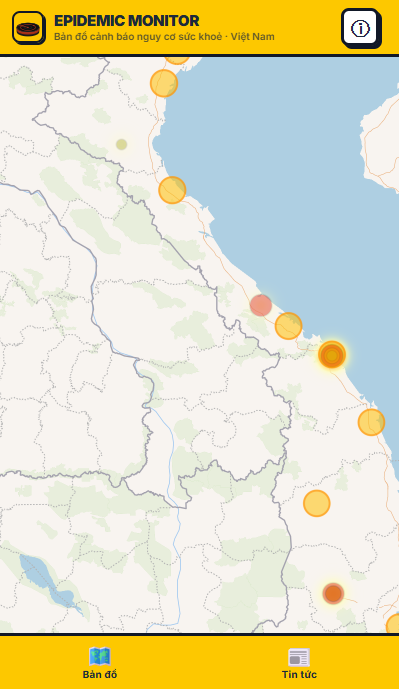
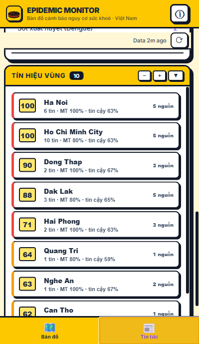

# Epidemic Monitor

**Bản đồ cảnh báo nguy cơ sức khỏe cộng đồng tại Việt Nam.**

Epidemic Monitor tổng hợp tin tức báo chí và tín hiệu môi trường để giúp người dùng nhìn nhanh các cụm thông tin dịch bệnh đang được nhắc tới tại Việt Nam. Ứng dụng tập trung vào khả năng quan sát sớm, đối chiếu nguồn, theo dõi theo tỉnh/thành và hỗ trợ đánh giá rủi ro thực dụng cho người dùng không chuyên.

> Đây là công cụ tham khảo, không phải hệ thống công bố dịch chính thức. Với quyết định y tế, vận hành trường học, doanh nghiệp hoặc chính sách công, cần đối chiếu với Bộ Y tế, CDC địa phương và cơ quan có thẩm quyền.

## Giao Diện

<p align="center">
  
</p>

<p align="center">
  
</p>

## Chức Năng Chính

- Bản đồ nguy cơ dịch bệnh giới hạn trong phạm vi Việt Nam.
- Lọc dữ liệu chỉ lấy thông tin dịch bệnh tại Việt Nam hoặc liên quan trực tiếp tới Việt Nam.
- Chuẩn hóa dữ liệu theo mô hình 34 tỉnh/thành mới.
- Bảng tin dịch bệnh từ nhiều nguồn báo chí Việt Nam.
- Chống trùng tin bằng canonical URL và gom nhóm theo bệnh, địa phương, ngày.
- Tín hiệu vùng: kết hợp số tin, mức độ cảnh báo, độ tin cậy nguồn và rủi ro môi trường.
- Dữ liệu khí hậu và môi trường gồm nhiệt độ, mưa, độ ẩm, PM2.5, PM10, ozone và NO2.
- Timeline 7 ngày, bộ lọc mức độ tin, tìm kiếm bệnh/địa phương và liên kết nguồn gốc.
- Banner cảnh báo đầu trang có ghi nhớ dismiss để không spam cùng một cảnh báo.

## Phạm Vi Dữ Liệu

Ứng dụng hiện chủ động loại bỏ dữ liệu ngoài Việt Nam. Các lớp bảo vệ gồm:

- Chỉ nhận bản ghi có `country` là Việt Nam hoặc có tỉnh/thành Việt Nam.
- Loại các tiêu đề rõ ràng nói về ổ dịch nước ngoài.
- Marker, heatmap và early-warning chỉ render khi tọa độ nằm trong khung Việt Nam.
- Không nạp ranh giới huyện cũ vì dữ liệu đó chưa tương thích với mô hình 34 tỉnh/thành.

Khi có bộ GeoJSON 34 tỉnh/thành chính thức và phù hợp giấy phép, lớp ranh giới hành chính có thể được bật lại.

## Cách Xử Lý Tin

Luồng dữ liệu chính:

1. Pipeline ingest thu thập tin y tế từ báo chí Việt Nam.
2. ChatGPT/LLM trích xuất bệnh, tỉnh/thành, số ca, mức độ tín hiệu và nguồn.
3. Dữ liệu được lưu vào D1/outbreak items.
4. API gom nhóm, lọc Việt Nam-only, chống trùng URL và trả về payload tối ưu cho frontend.
5. Frontend hiển thị bản đồ, bảng tin, timeline, tín hiệu vùng và thông báo.

Các tình huống được xử lý:

- Crawl lại gặp cùng một bài: canonical URL bỏ query/hash để không nhân đôi.
- Một bệnh xuất hiện nhiều bài trong cùng địa phương/ngày: gom nhóm thành một outbreak signal.
- Bản ghi không có tọa độ hợp lệ: không render lên bản đồ.
- Nguồn dữ liệu tạm lỗi: UI giữ trạng thái lỗi có nút refresh, không crash toàn app.

## Refresh Và Notify

- Nút refresh trên UI tải lại dữ liệu ngay lập tức.
- Auto-refresh chạy mỗi 10 phút, khớp với cache backend để giảm request thừa.
- Tuổi dữ liệu được cập nhật mỗi 30 giây.
- Banner cảnh báo chỉ hiện khi có nhóm `alert`; nếu người dùng đóng banner, cùng cảnh báo sẽ không hiện lại trong 6 giờ trừ khi có tín hiệu mới.
- Backend endpoint `/api/health/v1/all` trả về outbreak, news, stats và freshness trong một request để giảm số lần gọi function.

## Stack

- Frontend: TypeScript, Vite, MapLibre GL, deck.gl.
- Backend: Cloudflare Pages Functions.
- Storage/query: Cloudflare D1.
- Data enrichment: ChatGPT-compatible extraction pipeline.
- Testing: TypeScript typecheck, function typecheck, Playwright E2E.

## Chạy Local

```bash
npm install
npm run dev
```

Mặc định Vite chạy tại `http://localhost:5173`. Nếu port bận, Vite sẽ tự chọn port kế tiếp.

Kiểm tra trước khi commit:

```bash
npm run typecheck
npx tsc -p tsconfig.functions.json --noEmit
npm run build
```

## API Hữu Ích

- `/api/health/v1/all`: dữ liệu tổng hợp cho UI.
- `/api/health/v1/news`: danh sách tin đã lọc và chống trùng.
- `/api/health/v1/outbreaks`: cụm outbreak đã gom nhóm.
- `/api/health/v1/climate`: tín hiệu khí hậu và chất lượng không khí cho 34 tỉnh/thành.
- `/api/health/v1/timeseries`: timeline lịch sử theo ngày, bệnh và tỉnh/thành.
- `/api/health/v1/source-health`: độ phủ nguồn và freshness.

## Giới Hạn Hiện Tại

- Đây là social/listening intelligence, không phải báo cáo ca bệnh chính thức.
- Chất lượng phụ thuộc nguồn báo chí, lịch crawl, metadata xuất bản và độ chính xác trích xuất.
- Ranh giới bản đồ 34 tỉnh/thành chưa được vẽ cho tới khi có GeoJSON chính thức, đúng giấy phép.
- Dữ liệu khí hậu/môi trường chỉ là tín hiệu phụ trợ, không đủ để kết luận nguyên nhân dịch tễ.

## License

AGPL-3.0-only.
