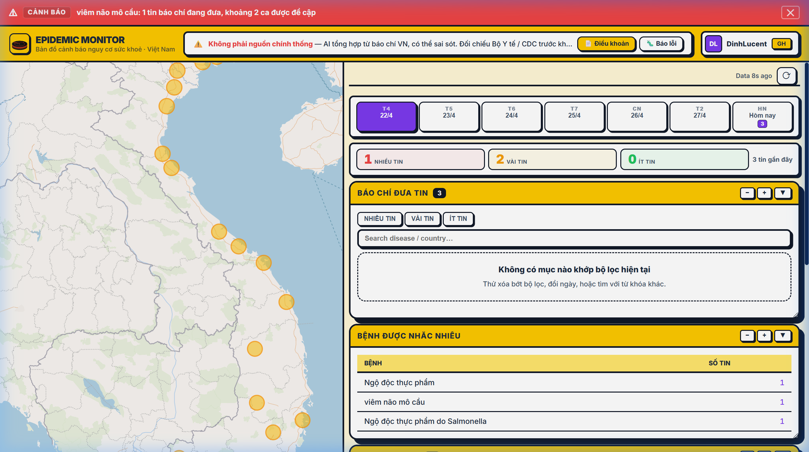
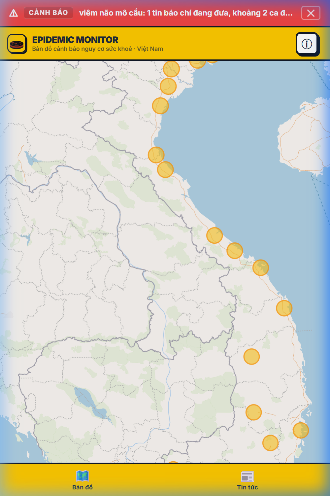
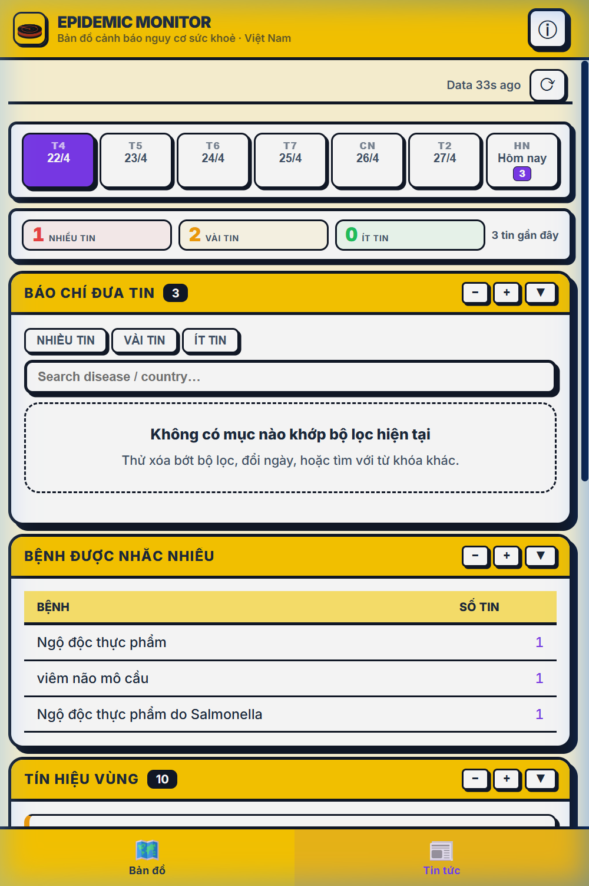

<p align="center">
  
</p>

<h1 align="center">Epidemic Monitor</h1>

<p align="center">
  <strong>Bản đồ cảnh báo nguy cơ sức khỏe cộng đồng tại Việt Nam</strong>
</p>

<p align="center">
  <a href="https://epidemic-monitor.pages.dev">🌐 Live Demo</a> ·
  <a href="#chức-năng-chính">✨ Features</a> ·
  <a href="#stack">🛠 Stack</a> ·
  <a href="#chạy-local">🚀 Quick Start</a>
</p>

<p align="center">
  
  
  
  
  
  
</p>

---

## 📸 Screenshots

<p align="center">
  
</p>

<p align="center">
  
  &nbsp;&nbsp;&nbsp;
  
</p>

---

## Giới Thiệu

Epidemic Monitor tổng hợp tin tức báo chí và tín hiệu môi trường để giúp người dùng nhìn nhanh các cụm thông tin dịch bệnh đang được nhắc tới tại Việt Nam. Ứng dụng tập trung vào khả năng **quan sát sớm**, **đối chiếu nguồn**, **theo dõi theo tỉnh/thành** và hỗ trợ đánh giá rủi ro thực dụng cho người dùng không chuyên.

> [!CAUTION]
> Đây là công cụ **tham khảo**, không phải hệ thống công bố dịch chính thức.
> Với quyết định y tế, vận hành trường học, doanh nghiệp hoặc chính sách công — cần đối chiếu với **Bộ Y tế**, **CDC địa phương** và cơ quan có thẩm quyền.

## Chức Năng Chính

| Tính năng | Mô tả |
|---|---|
| 🗺️ **Bản đồ nguy cơ** | Marker + heatmap hiển thị mức độ dịch bệnh trên bản đồ Việt Nam |
| 📰 **Bảng tin dịch bệnh** | Tổng hợp từ nhiều nguồn báo chí VN, chống trùng bằng canonical URL |
| 📊 **Tín hiệu vùng** | Kết hợp số tin, mức cảnh báo, độ tin cậy nguồn và rủi ro môi trường |
| 🌡️ **Dữ liệu khí hậu** | Nhiệt độ, mưa, độ ẩm, PM2.5, PM10, ozone, NO₂ cho 34 tỉnh/thành |
| 📅 **Timeline 7 ngày** | Lọc theo ngày, bệnh, địa phương — liên kết trực tiếp tới nguồn gốc |
| 🔔 **Banner cảnh báo** | Tự động hiện khi có tín hiệu `alert`, dismiss ghi nhớ 6 giờ |
| 🔎 **Tìm kiếm** | Tìm nhanh theo bệnh hoặc địa phương |
| 📱 **Responsive** | Giao diện Neobrutalist tối ưu cho cả mobile và desktop |

## Kiến Trúc

```
┌─────────────────────────────────────────────────────────────────┐
│                        FRONTEND (Vite)                          │
│  TypeScript · MapLibre GL · deck.gl · Neobrutalist CSS          │
└────────────────────────┬────────────────────────────────────────┘
                         │ fetch /api/health/v1/*
┌────────────────────────▼────────────────────────────────────────┐
│               CLOUDFLARE PAGES FUNCTIONS                        │
│  _middleware.ts → outbreak-query.ts → D1 SQL                    │
└────────────────────────┬────────────────────────────────────────┘
                         │
┌────────────────────────▼────────────────────────────────────────┐
│                    CLOUDFLARE D1                                │
│  outbreak_items · news · climate · source_health                │
└────────────────────────┬────────────────────────────────────────┘
                         │ write
┌────────────────────────▼────────────────────────────────────────┐
│              CHATGPT BACKGROUND WORKER                          │
│  RSS scan → queue → batch extract → verify → merge → publish    │
└─────────────────────────────────────────────────────────────────┘
```

## Luồng Xử Lý Dữ Liệu

1. **Ingest** — Pipeline thu thập tin y tế từ báo chí Việt Nam qua RSS.
2. **Extract** — ChatGPT/LLM trích xuất bệnh, tỉnh/thành, số ca, mức tín hiệu và nguồn.
3. **Store** — Dữ liệu lưu vào Cloudflare D1 (outbreak items).
4. **Serve** — API gom nhóm, lọc Vietnam-only, chống trùng URL, trả payload tối ưu.
5. **Render** — Frontend hiển thị bản đồ, bảng tin, timeline, tín hiệu vùng.

**Các tình huống edge-case được xử lý:**

- Crawl lại bài trùng → canonical URL (bỏ query/hash) để không nhân đôi.
- Nhiều bài cùng bệnh/địa phương/ngày → gom thành 1 outbreak signal.
- Bản ghi thiếu tọa độ → không render lên bản đồ.
- Nguồn lỗi tạm → UI giữ trạng thái lỗi + nút refresh, không crash app.

## Phạm Vi Dữ Liệu

Ứng dụng chủ động loại bỏ dữ liệu ngoài Việt Nam:

- Chỉ nhận bản ghi có `country` = VN hoặc tỉnh/thành Việt Nam.
- Loại tiêu đề nói về ổ dịch nước ngoài.
- Marker/heatmap chỉ render tọa độ trong khung Việt Nam.
- Chuẩn hóa theo mô hình 34 tỉnh/thành.

## Stack

| Layer | Công nghệ |
|---|---|
| **Frontend** | TypeScript, Vite 6, MapLibre GL, deck.gl 9 |
| **Backend** | Cloudflare Pages Functions |
| **Database** | Cloudflare D1 (SQLite edge) |
| **AI Pipeline** | ChatGPT-compatible extraction (SDK-driven) |
| **Linting** | Biome |
| **Testing** | TypeScript typecheck, Playwright E2E |
| **Deployment** | Cloudflare Pages |
| **Design** | Neobrutalist (thick borders, hard shadows, flat bold colors) |

## Chạy Local

```bash
# 1. Cài dependencies
npm install

# 2. Khởi động dev server
npm run dev
```

Mặc định Vite chạy tại `http://localhost:5173`. Nếu port bận, Vite sẽ tự chọn port kế tiếp.

### Kiểm tra code

```bash
npm run typecheck                          # TypeScript check
npx tsc -p tsconfig.functions.json --noEmit  # Functions typecheck
npm run build                              # Production build
```

## ChatGPT Background Worker

Quy trình cập nhật ưu tiên ChatGPT chạy nền thay vì gọi trong request người dùng.

```bash
# Chạy một vòng cập nhật
npm run refresh:chatgpt

# Chạy liên tục theo lịch
npm run refresh:chatgpt:loop

# Worker xử lý queue song song (không quét lại source)
npm run refresh:chatgpt:worker
```

### Production (ghi D1 remote)

```bash
npm run db:migrate:prod
npm run refresh:chatgpt:prod
npm run refresh:chatgpt:prod:loop
```

### Backfill queue vào D1

```bash
npm run sync:d1:prod
```

### Docker

```bash
docker compose up --build web              # Web only
docker compose --profile worker up --build # Web + worker
```

> Chi tiết Docker xem `docs/ops/docker.md`.

## API Endpoints

| Endpoint | Mô tả |
|---|---|
| `/api/health/v1/all` | Dữ liệu tổng hợp cho UI (outbreak + news + stats + freshness) |
| `/api/health/v1/news` | Danh sách tin đã lọc và chống trùng |
| `/api/health/v1/climate` | Tín hiệu khí hậu và chất lượng không khí (34 tỉnh/thành) |
| `/api/health/v1/timeseries` | Timeline lịch sử theo ngày, bệnh, tỉnh/thành |
| `/api/health/v1/source-health` | Độ phủ nguồn và freshness |

## Refresh & Notifications

- **Nút refresh** trên UI tải lại dữ liệu ngay lập tức.
- **Auto-refresh** mỗi 10 phút, khớp cache backend.
- **Tuổi dữ liệu** cập nhật mỗi 30 giây.
- **Banner cảnh báo** chỉ hiện khi có nhóm `alert`; đóng → không hiện lại trong 6 giờ (trừ tín hiệu mới).
- **Endpoint `/api/health/v1/all`** gom outbreak + news + stats + freshness trong 1 request.

## Tài Liệu Kiến Trúc

- [`docs/architecture/chatgpt-first-refresh-workflow.md`](docs/architecture/chatgpt-first-refresh-workflow.md) — Luồng ChatGPT background
- [`docs/architecture/sdk-driven-ai-extraction.md`](docs/architecture/sdk-driven-ai-extraction.md) — SDK-driven AI extraction
- [`docs/architecture/runtime-architecture.md`](docs/architecture/runtime-architecture.md) — Runtime architecture
- [`docs/architecture/project-context.md`](docs/architecture/project-context.md) — Project context

## Giới Hạn Hiện Tại

- Đây là **social/listening intelligence**, không phải báo cáo ca bệnh chính thức.
- Chất lượng phụ thuộc nguồn báo chí, lịch crawl, metadata và độ chính xác trích xuất.
- Ranh giới bản đồ 34 tỉnh/thành chưa được vẽ (chờ GeoJSON chính thức).
- Dữ liệu khí hậu/môi trường chỉ là tín hiệu phụ trợ.

## License

[AGPL-3.0-only](LICENSE)

---

<p align="center">
  <sub>Built with ☕ by <a href="https://github.com/phuc-nt">Phuc Nguyen</a></sub>
</p>
