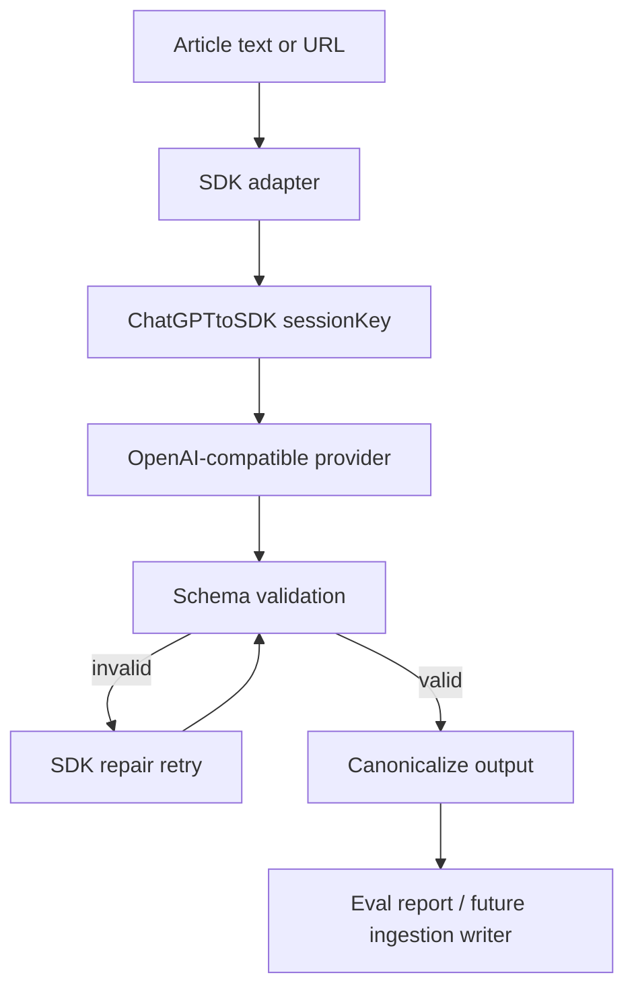

# SDK-Driven AI Extraction Architecture

## Goal

Use ChatGPTtoSDK as the only AI extraction control layer for Epidemic Monitor
experiments and ingestion adapters.

The application runtime still reads validated data from D1 and renders the map.
Model calls remain outside the frontend and outside Cloudflare Pages Functions.

## Current Boundary

```text
article text
-> ChatGPTtoSDK
-> OpenAI-compatible local endpoint
-> JSON schema validation
-> SDK repair/retry when needed
-> Epidemic Monitor canonicalizer
-> eval report or future ingestion writer
```

`chatgpt2api` is treated only as a local OpenAI-compatible provider:

```text
http://127.0.0.1:8010/v1/chat/completions
```

Do not import account pool, proxy, browser session, token import, or ChatGPT Web
logic into this repo.

## Functional Blocks

| Block | Responsibility | Main files |
| --- | --- | --- |
| SDK adapter | Create ChatGPTtoSDK runtime with SQLite state and OpenAI-compatible provider. | `src/services/local-ai/sdk-model-driver.ts`; `scripts/sdk-extraction-lib.mjs` |
| Prompt contract | Build the outbreak extraction role/task/output rules. | `src/services/local-ai/outbreak-extraction-prompt.ts` |
| Output schema | Define the required outbreak JSON shape, including nullable fields. | `src/services/local-ai/outbreak-extraction-schema.ts` |
| Canonicalizer | Normalize model output and reject unusable extraction. | `src/services/local-ai/outbreak-extraction-validator.ts` |
| Eval harness | Run dataset, live URL, and province coverage through SDK. | `scripts/eval-chatgpt2api-extraction.mjs`; `scripts/eval-chatgpt2api-province-coverage.mjs` |
| SDK state | Store sessions, runs, provider calls, validation events, and artifacts. | `.chatgpt-to-sdk/` |

## Control Flow



For the operational refresh model, use the background ChatGPT-first workflow in
`docs/architecture/chatgpt-first-refresh-workflow.md`. The key rule is that
ChatGPT belongs in scheduled ingestion/verification jobs, not in the user-facing
request path.

## Eval Commands

Set only the local service auth key in the current shell. Do not write it to
files.

```powershell
$env:CHATGPT2API_BASE_URL="http://127.0.0.1:8010"
$env:CHATGPT2API_AUTH_KEY="<local-service-auth-key>"

npm run eval:chatgpt2api -- --limit 3
npm run eval:chatgpt2api -- --url "https://example.test/article"
npm run eval:chatgpt2api:provinces -- --set legacy63 --limit 3
```

`npm run eval:local-llm` remains as a compatibility alias, but it now calls the
SDK-backed extractor. The old direct Ollama driver has been removed.

## Acceptance Criteria

- All extraction evals call ChatGPTtoSDK, not provider endpoints directly.
- SDK state is stored under `.chatgpt-to-sdk/`.
- No real account token, cookie, or upstream debug log is committed.
- `npm run typecheck` and `npm run build` pass.
- Dataset and province smoke evals pass against a configured local
  OpenAI-compatible endpoint.
